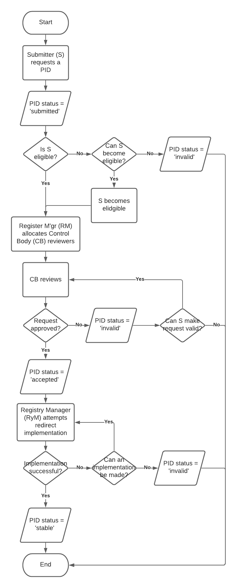

#### [Australian Government Linked Data Working Group](https://www.linked.data.gov.au)

# IRI Guidelines v2.1
#### December 14 2020
##### Authored by AGLDWG co-chair Nicholas Car\* and edited by members of the AGLDWG\*\*.
\* <nicholas.car@surroundaustralia.com>  
** [www.linked.data.gov.au/contact](https://www.linked.data.gov.au/contact)

## Preface
This document describes how the Australian Government Linked Data Working Group (AGLDWG) assess requests for and allocates persistent IRIs for Linked Data dataset, definitional resources and registers. It builds on both international public sector Linked Data IRI allocation guidance, such as the United Kingdom's "Designing URI Sets for the UK Public Sector" [[CAB-2010](#ref-CAB-2010)], and the AGLDWG's own 7+ year's experience with persistent IRI allocation.

## Table of Contents
1. [Preface](#Preface)
2. [Changelog](#Changelog)
3. [Conformance](#Conformance)
4. [Introduction](#Introduction)
5. [Persistent domain](#PersistentDomain)
6. [IRI Registration](#PIDIRIRegistration)
7. [Resource Types](#ResourceTypes)
8. [Datasets](#Datasets)
9. [Definitional Resources](#Definitional)
10. [Top-Level Registers](#TopLevelRegisters)
11. [Second-Level Registers](#SecondLevelRegisters)
12. [References](#References)
13. [Appendix A: Resource Linked Data requirements](#app-a)
14. [Appendix B: Resource catalogue item metadata](#app-b)

## Changelog
This version of the document contains only small editorial changes to the 2.0 version of the *Guidelines*. The changes are:

* addition of this Changelog section
* updates to author contact information
* updates to AGLDWG resource addresses (https://..., no longer http://...)
* change of terminology from URI to IRI
* fixing of typos
* addition of Org Register to list of registers
* addition of a note on IRI type allocations 2018-2020
* removal of references to incomplete conformance tests for resource in appendecies

See [the guidelines repository](https://github.com/AGLDWG/guidelines) for previous versions of the *Guidelines*.

For further context around this document and it's use, please see the AGLDWG's *Governance* web page:

* [www.linked.data.gov.au/governance](https://www.linked.data.gov.au/governance)

## 1. <a id="Conformance"></a> Conformance
The key words *MUST*, *MUST NOT*, *REQUIRED*, *SHOULD*, *SHOULD NOT*, *RECOMMENDED*, *MAY*, and *OPTIONAL* in this document are to be interpreted as defined in [[IETF-1997](#ref-IETF-1997)].

Roles associated with this catalogue acting as a 'Metadata Registry', *Overall Registration Authority*, *Registrar*, *Executive Committee*, *Control Committee*, *Overall Stewardship Organization*, *Steward*, *Overall Submitting Organization*, *Submitter*, *All others*, *Read-only user*, are to be interpreted as defined in [[ISO-2015](#ref-ISO-2015)].

IRI patterns are expressed using Augmented Backus-Naur Form, as defined in [[IETF-2008](#ref-IETF-2008)].

Status codes used for resources in the PID Allocations Catalogue of *accepted*, *deprecated*, *retired*, *valid*, *experimental*, *stable*, *not accepted*, *invalid*, *reserved*, *superseded*, *submitted*,  are taken from the Registry Ontology [[REY-2012](#ref-REY-2012)] and are re-presented by the AGLDWG as a Linked Data vocabulary at [[AGLDWG-2018b](#ref-AGLDWG-2018b)].

## 2. <a id="Introduction"></a>Introduction    
Government published, public sector information (PSI), usually about the things agencies are responsible for, is intended to be re-used by many, perhaps initially unknown, applications over time. This is to maximise its value to the nation and this aim is communicated in many places, such as the Productivity Commission's "Data Availability and Use" report of 2017 [[PC-2017](#ref-PC-2017)]. For this reason, it is important that elements PSI are able to be identified and accessed in consistent ways for long periods, perhaps multiple decades.

Government departments and agencies often assign identifiers to many digital PSI things and non-public information resources they are responsible for - e.g. datasets, classification concepts, hospitals, equipment, client interactions. These identifiers are then used when referring to or making statements about particular things. For example, when referring to a road closure, the identifier (e.g. "M5") will be used to inform the public or when referring to a particular census Mesh Block, its Australian bureau of Statistics-issued identifier, perhaps "80006300000" will be used. These identifiers might be well known but are most often not actionable, i.e. they cannot be easily used to discover information about the thing they identify, even if it exists, in standard ways.

The Australian Government Linked Data Working Group (AGLDWG) advocates the use of Linked Data [[W3C-2018](#ref-W3C-2018)] as a particular set of technologies to be used for Internet-distributed, machine-readable data and, due to this, advocates the use of Internationalized Resource Identifiers (IRIs) as identifiers for things. The use of IRIs as item identifiers greatly improves their accessibility and can also improve their endurance.

### 2.1 Internationalized Resource Identifiers (IRIs)
Linked Data uses IRIs which are part of a single, global, identification system used on the World Wide Web, similar to telephone numbers in a public switched telephone network. We are all familiar with IRIs at work - often referred to by older names of *Uniform Resource Identifier* (URI) or *Uniform Resource Locator* (URL) - due to their use for addresses in browsers for web pages. IRIs are a key technology supporting Linked Data offering a generic, universal and infinitely expandable mechanism to identify *things*. In order to publish data in a Linked Data fashion, government needs to represent the identifiers they use for things using IRIs.

Sir Tim Berners-Lee, who created many aspects of the World Wide Web we now take for granted, defined principles for the use of IRIs with Linked Data [[TBL-2009](#ref-TBL-2006)]. This document builds on those principles which, summarised, are:

#### 2.1.1. Use HTTP IRIs
Addressing two of the four principles, *'use URIs'* and *'use HTTP URIs'*, governments and their agencies publishing Linked Data ***MUST*** provide HTTP IRIs as identifiers for resources, in order to support reuse and data integration/linking on the Web in a Linked Data fashion. HTTP IRIs enable IRIs to be "looked-up" or "dereferenced", which in turn provides access, via a Web browser, to  representations of the resource identified by these IRIs.

#### 2.1.2. Provide a machine-readable representation of the resource identified by the IRI
In order to enable HTTP IRIs to be "dereferenceable", data publishers may have to set up the necessary infrastructure (e.g. DNS & HTTP servers) to serve representations or descriptions of resources (e.g. a human-readable HTML representation or a machine-readable RDF/XML representation). For a resource to be considered Linked Data, a publisher ***MUST*** publish it using RDF and ***MUST*** publish at least one machine-readable representation of it (e.g. RDF/XML, JSON-LD, Turtle) via the HTTP IRI identifying the resource.

Requirement | Description | Conformance
---|---|---
<a id="req-1"></a>[Req 1] | Use HTTP IRIs for Linked Data resources | ***MUST***
<a id="req-2"></a>[Req 2] | Provide at least one machine-readable representation in RDF at a resource's IRI. | ***MUST***

#### 2.1.3 IRI persistence
Much thought has gone into ensuring that IRIs for things can be made to keep working for a long time, starting with their technical design to avoid specific technology dependence (addressed by [[TBL-2009](#ref-TBL-2006)] and for Linked Data use in [[W3C-2008](#ref-W3C-2008)]) and extending to the governance arrangements for them to avoid, or at least make more resilient, their social systems dependence. Principles for successful persistent identifier generation are articulated in papers such as "The challenge of ensuring persistency of identifier systems" [[CAR-2017](#ref-CAR2-17)] which, among other things, advocates for the use of organisationally-independent identifiers.

Beyond confirming adherence to these principles, the AGLDWG provides instruction on how to create IRIs for certain kinds of resources according to IRI construction best practice [[W3C-2012](#ref-W3C-2012)] and also provides a government organisation-independent namespace for them to use: `linked.data.gov.au`. This namespace, an internet domain, is managed by the AGLDWG.

## 3. <a id="PersistentDomain"></a>Persistent Domain
The AGLDWG has dedicated the IRI domain `linked.data.gov.au` to persistent identifiers (PIDs) for Linked Data resources. This is to be able to supply infinitely many PID IRIs using a domain that is not coupled to a particular agency's name or function, for example `dfat.gov.au` which is coupled to the Department of Foreign Affairs and Trade (DFAT). Agency names and functions change over time and are thus domains based on them are not persistent. The use of `linked.data.gov.au` is protected by a Memorandum of Understanding signed by the managing agency, the Digital Transformation Agency and 5 agencies interested in Linked Data [[AGLDWG-2018](#ref-AGLDWG-2018)] which came into effect in May, 2018. The MoU requires any proposed changes to the management or use of the domain to be mooted amongst the MoUs signatories.

Requirement | Description | Conformance
---|---|---
<a id="req-3"></a>[Req 3] | Use the domain `linked.data.gov.au` for organisation-independent, Linked Data HTTP IRIs | ***MUST***

While the AGLDWG can assist with HTTP IRIs generally, it will only provide formal assistance for those within this domain.

The AGLDWG maintains a public catalogue of requests for PID IRIs within `linked.data.gov.au` and of the statuses of those requests (e.g. *submitted*, *accepted*, *invalid* etc.). The "PID Allocations Catalogue" is online at:

* [catalogue.linked.data.gov.au](https://catalogue.linked.data.gov.au)

### 3.1 Previously used domains
The AGLDWG maintains two legacy persistent domains:

1. `environment.data.gov.au`
2. `reference.data.gov.au`

These two domains contains persistent identifiers minted in 2013 - 2018. Resources allocated PID IRIs within them appear in the resource catalogue ([catalogue.linked.data.gov.au](http://catalogue.linked.data.gov.au)) and will be maintained indefinitely, however no new PID IRIs will be allocated using these legacy domains.

### 3.1 Test domain
The AGLDWG maintains a dedicated testing domain, `test.linked.data.gov.au`. *Submitting Organizations* (see role definition below) may request use of this domain to test PID IRIs before seeing a PID IRI allocation for a resource.

### 3.2 Other domains
The AGLDWG maintains further subdomains of `linked.data.gov.au` for operational reasons such as website hosting (`www.linked.data.gov.au`) and resource cataloguing (`catalogue.linked.data.gov.au`). These domains, while maintained by the AGLDWG are not to be considered persistent.

## 4. <a id="PIDIRIRegistration"></a>PID IRI Registration
Due to the central management by the AGLDWG of the `linked.data.gov.au` resource and its requirement to be shared among many agencies, PID IRIs allocated using it need to be registered to avoid collisions (agencies wanting the same IRIs for different things) and also anonymous orphans (PID IRIs once registered which become non-functional and for which ownership information is lost). Previous approaches to PID IRI allocation by the AGLDWG that did not require registration resulted in ungoverned IRIs.

The AGLDWG notes item registration is both commonplace for shared government resources (viz. registration of datasets within [data.gov.au](https://data.gov.au)) and also for IRI-based identifiers (viz. [purl.org](http://purl.org) and [w3id.org](https://w3id.org/)).

The AGLDWG requires all allocated PID IRIs to be registered with the group and provides guidance below on what types of IRIs may be registered, and the process for registration, including information required from registrants.

Registration processes (Section 6.2, 7.2 & 8.2 below), follow those of ISO/IEC 11179 [[ISO-2015](#ref-ISO-2015)] with registration of a resource catalogue entry needing to be assigned an approval status of *accepted* (see Section 4.3) being the necessary and sufficient criteria for PID IRI allocation for that resource.

### 4.1 Registration roles
The AGLDWG as a whole plays the roles of *Overall Registration Authority* and also *Overall Stewardship Organization*. The Recommendations subgroup of the AGLDWG plays the role of *Registrar* & *Executive Committee*. The Solutions subgroup of the AGLDWG plays the role of *Control Committee* and also *Steward*. See [www.linked.data.gov.au/groups](https://www.linked.data.gov.au/groups) for more information about AGLDWG structure.

Government entities requesting PID IRIs play the role of *Overall Submitting Organization* and individuals or groups within those entities submitting specific resources play the role of *Submitter*. Only AGLDWG members may act as an *Overall Submitting Organization*. See [www.linked.data.gov.au/join](https://www.linked.data.gov.au/join) for more information about joining the AGLDWG.

The AGLDWG sees members of any organisation without roles defined above and members of the general public as playing the role of *Read-only user* in that all AGLDWG registers and metadata are freely available and able to be read in a read-only fashion.

AGLDWG groups and related parties and the ISO11179 roles assigned to them described above are summarised in the Table 1.

**Table 1**: AGLDWG groups and related parties and the ISO11179 roles assigned to them  

Group | Role
---|---
AGLDWG | *Overall Registration Authority*, *Overall Stewardship Organization*
Recommendations Subgroup | *Registrar*, *Executive Committee*
Solutions Subgroup | *Control Committee* and also *Steward*
Government entities, members of the AGLDWG | *Overall Submitting Organization*
Members of above requesting PID IRIs | *Submitter*
Everyone not listed above | *Read-only user*

### 4.2 Registration workflow
The processing of items for which PID IRIs are requested follow workflows. The general workflow for item processing is given in Figure 1.

  
**Figure 1**: Workflow diagram showing the general workflow for the approval processing of PID IRI allocation requests. Approval statuses are marked.

A more detailed workflow for resource review is given in Figure 2.

  
**Figure 2**: Workflow diagram showing detailed steps within the resource review workflow. Approval statuses are marked.

A more detailed workflow showing PID IRI implementation is given in Figure 3.

  
**Figure 3**: Workflow diagram showing detailed steps within the PID IRI implementation workflow. Approval statuses are marked.

Notes on specific workflows per resource type are given below in Sections 6 - 9.

Requirement | Description | Conformance
---|---|---
<a id="req-4"></a>[Req 4] | Submitters requesting PID IRIs must follow the AGLDWG's PID IRI allocation workflows and submit their requests to the PID Allocations Catalogue | ***MUST***

### 4.3 Approval status
An item's acceptance for PID allocation is indicated with a *status*, terms for which are taken from the Registry Ontology's status vocabulary. The original publication of this vocabulary is [[REY-2012](#ref-REY-2012)] and the AGLDWG has republished it at [[AGLDWG-2018b](#ref-AGLDWG-2018)]) to enable better visibility. The status vocabulary term hierarchy is:

* [accepted](https://linked.data.gov.au/def/status/accepted)
  * [deprecated](https://linked.data.gov.au/def/status/deprecated)
    * [retired](https://linked.data.gov.au/def/status/retired)
    * [superseded](https://linked.data.gov.au/def/status/superseded)
  * [valid](https://linked.data.gov.au/def/status/valid)
    * [experimental](https://linked.data.gov.au/def/status/experimental)
    * [stable](https://linked.data.gov.au/def/status/stable)
* [not accepted](https://linked.data.gov.au/def/status/notAccepted)
  * [invalid](https://linked.data.gov.au/def/status/invalid)
  * [reserved](https://linked.data.gov.au/def/status/reserved)
  * [submitted](https://linked.data.gov.au/def/status/submitted)

 A state diagram of resources' statuses is given in Figure 4 below.

  
**Figure 4**: State diagram showing status states of a resource and actions causing state change.  

Following Figure 4, it can be seen that minimal successful path for a resource from first PID IRI request to operational implementation is:

`submitted -> accepted -> stable`


## 5. <a id="ResourceTypes"></a>Resource Types
Presently the AGLDWG recognises four types of items for which PID IRIs may be requested:

1. Dataset
2. Definitional Resource
3. Top-Level Register
4. Second-Level Register

There is an additional resource type, *Organisation*, for which IRIs are created automatically - to identifier AGLDWG member organisations.

More types of items may be added in the future. Such an addition will require this document to be updated.

IRIs for Datasets are created within the *Dataset Register*, for definitional resources within the *Def Register* and for Top-Level Register items within the *Top-Level Register*. This Top-Level Register contains the Dataset Register, the Def Register and the Organisations Register as subregisters. Second-Level Register items are created as registers within individual Datasets or as modules within Top-Level Registers, as detailed in [Section 9](#9-second-level-register-IRIs).

The next four sections of this document describe how IRIs for the four type of items for which they may be requested are formulated and the processes to apply for them.

#### Note type implementation 
After 2+ years of operations of these *Guidelines* in their present form, from pre-2018 to 2020, no allocations of IRIs for resource types other than Datasets or Definitional Items have been made. This does not mean that allocations for other resource types cannot be made but that the community has so far not found pressing use for resources other than Datasets or Definitional Items. The Top-Level Register guidance here is retained without afferming its expected use: it is a technical possibility with international precedence for use (see [[CAB-2010](#ref-CAB-2010)]) and the AGLDWG may, or may not, choose to use it.

## 6. <a id="Datasets"></a>Datasets
Dataset can have IRIs that identify the dataset as a whole. These IRIs are somewhat analogous to the IRIs used to indicate datasets in the [data.gov.au](https://data.gov.au) catalogue (e.g. <https://data.gov.au/dataset/rottnest-ferries-underway-temperature> indicating the "Rottnest Ferries Underway Temperature" dataset) but they have more requirements placed on them in order to perform more functions, specifically Linked Data functions. Where IRIs for datasets in `data.gov.au` resolve to a landing page about the dataset and give access to its metadata and links to distributions of it, `linked.data.gov.au` dataset IRIs both link to metadata and also act as a top-level register for items within the dataset. Additionally, `linked.data.gov.au` dataset IRIs are dataset-specific namespace domains which can be used to create unique IRIs for sub-dataset items. For example, a Linked Data version of the "Rottnest Ferries Underway Temperature" dataset could have a IRI for each temperature observation which, if delivered at `linked.data.gov.au`, could be something like `https://data.gov.au/dataset/rottnest-ferries-underway-temperature/observation/0026` for an *observation* identified by *0026*.

Dataset producers are free to choose the form that their sub-dataset item IRIs take (so-called *hash* or *slash* IRIs (see [[W3C-2016](#ref-W3C-2016)]) however they must deliver both the top-level register of their dataset and all visible subcomponents of it according to Linked Data principles.

Requirement | Description | Conformance
---|---|---
<a id="req-5"></a>[Req 5] | Resources identified using PID IRIs must contain Linked Data and must pass the conformance tests specified for that resource type | ***MUST***

The tests for what constitutes a valid Linked Data dataset are articulated in [Appendix A](#app-a).

### 6.1 Dataset PID IRI pattern
The pattern for Dataset PID IRIs is:

```
dataset-IRI = "https://linked.data.gov.au/dataset/" dataset-id
dataset-id = *(ALPHA / DIGIT / "-")
```

Where `dataset-id` is both unique within the Dataset Register and conceptually linked to the dataset.

An example is that a Linked Data dataset titled "Geocoded National Address File" (G-NAF) could use the `dataset-id` of "gnaf", being an acronym of the title, and thus make the `dataset-IRI` of:

`https://linked.data.gov.au/dataset/gnaf`

Subelements of the dataset may have IRIs generated with the following pattern:

```
dataset-subelement-IRI = dataset-IRI hash-or-slash subelement-path
hash-or-slash = "#" / "/"
subelement-path = subelement-hash-id / class-path subelement-slash-id
subelement-hash-id = *(ALPHA / DIGIT / "-")
class-path = *(ALPHA / DIGIT / "-" / "/")
subelement-slash-id = *(ALPHA / DIGIT / "-")
```

Where the "gnaf" dataset, using hash IRIs for Address subelements "GA1234" could make a `dataset-subelement-IRI` of:

`https://linked.data.gov.au/dataset/gnaf#GA1234`

Where the "gnaf" dataset, using slash IRIs for Address subelement "GA1234" could make  `dataset-subelement-IRI` of:

`https://linked.data.gov.au/dataset/gnaf/address/GA1234`

### 6.2 Registration Process
This process follows the general process as outlined in Figure 1.

* *Submitter* must be eligible, as per Req 6
  * *Submitter* initiates a request for a PID IRI allocation for a dataset IRI by creating a complete catalogue record in the AGLDWG LD Resource Catalogue
  * the resource type must be set to 'dataset'
  * request approval status to `submitted`
* *Controlling Committee* is automatically notified to review the request by the catalogue
* *Controlling Committee* reviews the request and approves it if it passes the metadata and Linked Data tests for a dataset described in [Appendix B](#app-b) and [Appendix A](#app-a), respectively
  * if approved, request approval status to `approved`
  * if not approved, resource status set to `not approved`
  * *Submitter* automatically notified of status change
* if approved, *Steward* implements a IRI redirect to the hosted dataset and tests implementation
  * if no collisions with existing patterns are found:
    * if the resource is ready, approval status to `stable`
    * if the resource is not ready, else approval status set to `reserved`
  * if collisions are found, approval status set to `invalid`
  * *Submitter* notified
* *Submitting Organization* is free to use allocated IRIs

In the event of more than one request for the same `dataset-id`, application precedent wins, so the first application for a particular `dataset-id`, if successful, will be awarded it. Precedents is determined by date of application completion, not date of application lodgement. This is to prevent intentional or accidental IRI squatting with applications that cannot be, or are not, implemented. This is also true for other resource types and for their respective IDs.

Requirement | Description | Conformance
---|---|---
<a id="req-6"></a>[Req 6] | For a particular PID IRI to be allocated, the request for that allocation must be the first request for it that is found eligible | ***MUST***


### 6.3 Required Metadata
Metadata to be supplied for the registration of a Linked Data dataset, and thus the allocation of a IRI for it, must constitute a valid record for a dataset within the AGLDWG LD Resource Catalogue. Record validity is determined using the process outlined in [Appendix B](#app-b).

Entries in the AGLDWG LD Resource Catalogue are public from submission onwards.


## 7. <a id="Definitional"></a>Definitional Resources
Definitional Resources are Linked Data vocabularies, vocabulary terms, ontologies, ontology terms and potentially other, Linked Data, data model items. Currently, as per Datasets, IRI patterning is provided by the AGLDWG at the whole-of-resource level (i.e. whole ontology or whole vocabulary) with IRIs for subcomponents such as vocabulary terms or ontology class definitions to be implemented by the definitional resource managers, at their discretion.

### 7.1 Definitional resource PID IRI pattern
The pattern for Definitional PID IRIs is:

```
definitional-IRI = "https://linked.data.gov.au/def/" definitional-id
definitional-id = *(ALPHA / DIGIT / "-")
```

Where `definitional-id` is both unique within the Definitional Resources Register and conceptually linked to the resource.

An example is that an ontology used to deliver content for a Linked Data implementation of the "Geocoded National Address File" (G-NAF) could use the `definitional-id` of "gnaf" and thus make the `definitional-IRI` of:

`https://linked.data.gov.au/def/gnaf`

Another example is that a vocabulary established listing all the types of citizenship status of people in Australia titled "Citizenship Status" could use the `definitional-id` of "citstatus" and thus make the `definitional-IRI` of:

`https://linked.data.gov.au/def/citstatus`

Subelements of the definitional resources may have IRIs generated with the following pattern:

```
definitional-subelement-IRI = definitional-IRI hash-or-slash subelement-path
hash-or-slash = "#" / "/"
subelement-path = subelement-hash-id / class-path subelement-slash-id
subelement-hash-id = *(ALPHA / DIGIT / "-")
class-path = *(ALPHA / DIGIT / "-" / "/")
subelement-slash-id = *(ALPHA / DIGIT / "-")
```

Where the "gnaf" ontology, using hash IRIs could make a `definitional-subelement-IRI` for an `Address` class of:

`https://linked.data.gov.au/def/gnaf#Address`

Where the "gnaf" ontology, using slash IRIs for `StreetType` codes could make a `definitional-subelement-IRI` for the street type `Avenue` of:

`https://linked.data.gov.au/def/gnaf/Avenue`

or, if the `StreetType` codes were modularised within the ontology perhaps:

`https://linked.data.gov.au/def/gnaf/code/StreetTypes/Avenue`

### 7.2 Registration Process
This process follows the general process as outlined in Figure 1.

* *Submitter* must be eligible, as per Req 6
  * *Submitter* initiates a request for a PID IRI allocation for a
    definitional resource IRI by creating a complete catalogue record in the AGLDWG LD Resource Catalogue
  * the resource type must be set to 'definitional'
  * request approval status to `submitted`
* *Controlling Committee* is automatically notified to review the request by the catalogue
* *Controlling Committee* reviews the request and approves it if it passes the metadata and Linked Data tests for a definitional resource described in [Appendix B](#app-b) and [Appendix A](#app-a), respectively
  * if approved, request approval status to `approved`
  * if not approved, resource status set to `not approved`
  * *Submitter* automatically notified of status change
* if approved, *Steward* implements a IRI redirect to the hosted definitional resource and tests implementation
  * if no collisions with existing patterns are found:
    * if the resource is ready, approval status to `stable`
    * if the resource is not ready, else approval status set to `reserved`
  * if collisions are found, approval status set to `invalid`
  * *Submitter* notified
* *Submitting Organization* is free to use allocated IRIs

### 7.3 Required Metadata
Metadata to be supplied for the registration of a Linked Data definitional resource, and thus the allocation of an IRI for it, must constitute a valid record for such within the AGLDWG LD Resource Catalogue. Record validity is determined using the process outlined in [Appendix B](#app-b).

Entries in the AGLDWG LD Resource Catalogue are public from submission onwards.


## 8. <a id="TopLevelRegisters"></a>Top-Level Register IRIs
Top-Level Registers are an index of individual Linked Data objects, promoted to the 'top' of `linked.data.gov.au` for high visibility. Such registers are formulated using very basic information:

* the identity of the register itself (given via its IRI)
* metadata according to the Registry Ontology [[17](#ref-17)]
* a listing of the class(es) of items within the register and potentially Registry Ontology links to sub pages of the register. Lists of particular classes of LD objects that both allow for shorter IRIs to items within datasets and also allow items within them to not use IRIs deriving from them. As with datasets and definitional resources registered with the AGLDWG for IRI allocation, top-level registers require metadata to be lodged so that the content and ownership of the register is known and can be managed.

Since top-level registers are designed to promote and aggregate assessed in order to determine the appropriateness of the requested IRI to the class(es) of objects to be listed in the register.

A simple example:

A *Submitting Organization* wishes to have a IRI allocated for a top-level register of items of class *widget* and requests `linked.data.gov.au/widget/`. First the *Submitting Organization* will have to have published at least one dataset containing *widgets*, perhaps `linked.data.gov.au/dataset/ds1` containing the (second-level) register `linked.data.gov.au/dataset/ds1/widget/`. The AGLDWG will check that no `widget/` top-level register already exists and, if not, determine if the path segment `widget/` is a fair representation of the items to be listed in that register. Fairness could stem from the name 'widget' approximating the class identity of the items in the register and a minimal chance of the path segment leading users to understand some meaning other than that intended by the *Submitting Organization*, perhaps as a result of commonly used terms in the LD community.

A more complex example about inappropriate naming:

A *Submitting Organization*  wishes to allocate `linked.data.gov.au/service/` for a collection of government services to members of the public. The *Submitting Organization* has published a dataset containing a register of items of class `srv:Service` where 'srv' is a government business ontology. Here the AGLDWG cannot easily approve the request given the generic nature of 'service' which could easily be misconstrued by a user; perhaps they expect a register of Web Service objects.

A federated register example:

A *Submitting Organization*, in this case the Royal Australian Navy (RAN), wishes to allocate `linked.data.gov.au/ship/` for a list of ships that they have published in multiple datasets, `linked.data.gov.au/dataset/ds1/ship/` & `linked.data.gov.au/dataset/ds2/ship/`. The RAN will have to ensure that the allocated register resolves to a collection of ships from both datasets.

Where multiple *Submitting Organization* s wish to combine their data into a single top-level register, they must arrange for federated register presentation, not the AGLDWG.

A multi-class example:

A *Submitting Organization* wishes a top-level register for items of class A and class B. There is some real-world logic making such an allocation sensible so the *Submitting Organization* requests the top-level register `linked.data.gov.au/classAB/` which is approved. A better request though would be for a register of `linked.data.gov.au/classC/` where class C is a superclass of both class A and B.

#### 8.0.1 Use and non-use of Register IRI for contained items
A *Submitting Organization* may request a top-level register such as `linked.data.gov.au/classA/` and then present items within that class with IRIs such as `linked.data.gov.au/classA/1`, `linked.data.gov.au/classA/2` etc. but may also present items with un-related IRIs within the register as long as the class of item (discoverable via de-referenceable RDF) accords with the class(es) for which the register was allocated. The AGLDWG may check the classes of items within a top-level register using automated means.

#### 8.0.2 Subregisters
If a *Submitting Organization* wishes to use a top-level register already allocated for new items in accordance with the class(es) for with the register was allocated, they have two options:

1. arrange with the original *Submitting Organization* to have their items included in the register
2. request a module within the Top-Level Register for their items

Modules requested within a top-level register will be presented as sub-registers of the Top-Level Register. Management of such is the responsibility of the Top-Level Register's manager - the original *Submitting Organisation* who was allocated the IRI for it, not the AGLDWG.

### 8.1 Top-Level Register IRI pattern
The pattern for allocating Top-Level Register IRIs is:

```
register-IRI = "https://linked.data.gov.au/" register-id "/"
register-id = *(ALPHA / DIGIT / "-")
```

Where `register-id` is some approximation of the class(es) of object which the register contains. What is a fair approximation and what is not will be judged by the *Controlling Committee*.

An example is that a *Submitter* may request present a register of organisations, containing `Organization`-class individuals as defined in the Organization Ontology [[W3C-2014c]()#ref-W3C-2014c)] and request the allocation of:

`https://linked.data.gov.au/organisation/`

Alternatively, the *Submitter* may request the allocation of:

`https://linked.data.gov.au/org/`

where 'org' is a well-known shortened form of 'organisation'. Either of these requests are potentially suitable for allocation.

**NOTE**: the top-level register of `/org/` is already allocated for automated use by the AGLDWG where it is used to identify AGLDWG members's agencies requesting IRIs.

Subregisters within a Top-Level Register are to be managed by the manager of the Top-Level register with the `module-id` to be allocated by them. The total IRI pattern for this form of modularised register is:

```
modularised-register-IRI = register-IRI "/" module-id
module-id = *(ALPHA / DIGIT / "-")
```

### 8.2 Registration Process
This process follows the general process as outlined in Figure 1.

* *Submitter* must be eligible, as per Req 6
  * *Submitter* initiates a requests a PID IRI allocation for a top-level register IRI by creating a complete catalogue record in the AGLDWG LD Resource Catalogue
  * the resource type must be set to 'top-level register'
  * request approval status to `submitted`
* *Controlling Committee* is automatically notified to review the request by the catalogue
* *Controlling Committee* reviews the request and approves it if it passes the metadata and Linked Data tests for a top-level register described in [Appendix B](#app-b) and [Appendix A](#app-a), respectively
  * if approved, request approval status to `approved`
  * if not approved, resource status set to `not approved`
  * *Submitter* automatically notified of status change
* if approved, *Steward* implements a IRI redirect to the hosted top-level register and tests implementation
  * if no collisions with existing patterns are found:
    * if the resource is ready, approval status to `stable`
    * if the resource is not ready, else approval status set to `reserved`
  * if collisions are found, approval status set to `invalid`
  * *Submitter* notified
* *Submitting Organization* is free to use allocated IRIs

### 8.3 Required Metadata
Metadata to be supplied for the registration of a Linked Data top-level register, and thus the allocation of a IRI for it, must constitute a valid record for such within the AGLDWG LD Resource Catalogue. Record validity is determined using the process outlined in [Appendix B](#app-b).

Entries in the AGLDWG LD Resource Catalogue are public from submission onwards.


## 9. <a id="SecondLevelRegisters"></a>Second-Level Register IRIs
At this stage, the AGLDWG recognises there are two sorts of Second-level Registers for which IRIs may be allocated:

1. subregisters of a Dataset
2. modularised subregisters of a Top-Level Register

In both cases, the IRI arrangements for the Second-Level Register IRIs need to be made by the dataset or Top-Level Register manager, however the AGLDWG can assist with implementing redirects for these subregisters within the patterning assigned to a Dataset or Top-Level Register, if requested. Such pattern implementation will follow the workflow given in Figure 3 but will not result in any change to the relevant allocation status of the Dataset or Top-Level Register.

## 10. <a id="References"></a>References
[AGLDWG-2018] <a name="ref-AGLDWG-2018"></a>Australian Government Linked Data Working Group "Governance", web page, 2018. <https://www.linked.data.gov.au/governance>, accessed 2018-07-27.

[AGLDWG-2018b] <a name="ref-AGLDWG-2018b"></a>Australian Government Linked Data Working Group, "Status Vocabulary". SKOS Vocabulary, 22 July 2018. <http://test.linked.data.gov.au/def/status>, accessed 2018-07-22.

[CAB-2010] <a name="ref-CAB-2010"></a>Cabinet Office, "Designing IRI Sets for the UK Public Sector", web page, 2010. <https://www.gov.uk/government/publications/designing-IRI-sets-for-the-uk-public-sector>, accessed 2018-06-07.  

[CAR-2017] <a href="ref-CAR-2017"></a>Car, Nick; Golodoniuc, Pavel; Klump, Jens. "The challenge of ensuring persistency of identifier systems in the world of ever-changing technology". Data Science Journal. 2017; 16: Article 13. <https://doi.org/10.5334/dsj-2017-013>

##### Not used
[DCMI-2012] <a name="ref-DCMI-2012"></a>Dublin Core Metadata Initiative "DCMI Metadata Terms", web page, 2012. <http://www.dublincore.org/documents/dcmi-terms/>, accessed 2018-06-07.

##### Not used
[IETF-2012] <a name="ref-IETF-2012"></a>Internet Engineering Task Force "RFC6570: IRI Template", proposed standard, 2012. <http://tools.ietf.org/html/rfc6570>, accessed 2018-06-07.  

##### Not used
[IETF-1999] <a name="ref-IETF-1999"></a>Internet Engineering Task Force "RFC2616: Hypertext Transfer Protocol -- HTTP/1.1", Request for Comment, 1999. <http://www.ietf.org/rfc/rfc2616>, accessed 2018-06-07.  

[IETF-1997] <a name="ref-IETF-1997"></a>Internet Engineering Task Force, Network Working Group "Key words for use in RFCs to Indicate Requirement Levels", Request for Comments: 2119, 1997. <http://www.ietf.org/rfc/rfc2119>, accessed 2018-06-07.

[IETF-2008] <a name="ref-IETF-2008"></a>Internet Engineering Task Force, Network Working Group "Internet Standard 68: Augmented BNF for Syntax Specifications: ABNF". Internet Engineering Task Force, 2008. <https://tools.ietf.org/html/std68>, accessed 2018-06-07.  

[ISO-2015] <a name="ref-ISO-2015"></a>International Organization for Standardization / International Electrotechnical Commission "ISO/IEC 11179, Information Technology -- Metadata registries (MDR)", standard. <http://metadata-standards.org/11179/>, accessed 2018-06-07.

##### Not used
[FIEL-2005] <a name="ref-FIEL-2005"></a>Fielding, Roy T. "[httpRange-14] Resolved", archived email, 2005. <http://lists.w3.org/Archives/Public/www-tag/2005Jun/0039.html>, accessed 2018-06-07.  

[PC-2017] <a href="ref-PC-2017"></a>Productivity Commission, "Data Availability and Use", public inquiry report, 8 May 2017. <http://www.pc.gov.au/inquiries/completed/data-access>

[REY-2012] <a name="ref-REY-2012"></a>Reynolds, Dave "Registry ontology", Version 0.2. OWL Ontology,  2012-11-11 <http://epimorphics.com/public/vocabulary/Registry.html>, accessed 2018-07-22.

[TBL-2006] <a name="ref-TBL-2006"></a>Berners-Lee, Tim "Linked Data", web page, 2006. <http://www.w3.org/DesignIssues/LinkedData.html>, accessed 2018-06-07.  

[W3C-2008] <a name="ref-W3C-2008"></a>World Wide Web Consortium "Cool IRIs for the Semantic Web", W3C Interest Group Note, 03 December 2008. <http://www.w3.org/TR/coolIRIs/>, accessed 2018-06-07.  

[W3C-2012] <a name="ref-W3C-2012"></a>World Wide Web Consortium "223 Best Practices IRI Construction", wiki web page, 2012. <http://www.w3.org/2011/gld/wiki/223_Best_Practices_IRI_Construction>, accessed 2018-06-07.

[W3C-2014] <a name="ref-W3C-2014"></a>World Wide Web Consortium "RDF 1.1 Concepts and Abstract Syntax", W3C Proposed Recommendation, 09 January 2014. <http://www.w3.org/TR/rdf11-concepts/>, accessed 2018-06-07.  

[W3C-2014b] <a name="ref-W3C-2014b"></a>World Wide Web Consortium "RDF Schema 1.1", W3C Recommendation, 25 February 2014. <http://www.w3.org/TR/rdf-schema/>, accessed 2018-07-22.

[W3C-2014c] <a name="ref-W3C-2014c"></a>World Wide Web Consortium "The Organization Ontology", W3C Recommendation 16 January 2014. <https://www.w3.org/TR/vocab-org/>, accessed 2018-07-30.

[W3C-2016] <a href="ref-W3C-2016">World Wide Web Consortium, "HashVsSlash", web page, 2016. <https://www.w3.org/wiki/HashVsSlash>, accessed 2018-07-27.

[W3C-2017] <a name="ref-W3C-2017"></a>World Wide Web Consortium "HTML 5.2", W3C Recommendation, 14 December 2017. <https://www.w3.org/TR/html/>, accessed 2018-07-28.

[W3C-2018] <a name="ref-W3C-2018"></a> World Wide Web Consortium, "Linked Data", web page, 2018. <https://www.w3.org/standards/semanticweb/data>, accessed 2018-07-27.

## 11. <a id="app-a"></a>Appendix A: Resource Linked Data requirements
Resources for which the AGLDWG issues PID IRIs must be valid Linked Data. Specific requirements for each type of resource are listed below.

#### Datasets:
1. ***MUST*** present a landing page for the dataset in RDF
  * the RDF must pass basic RDF syntactic validation
  * the issued PID IRI must be able to resolve to at least one standard serialisation of RDF which the AGLDWG takes to be either RDF/XML, Turtle, JSON-LD, N-triples or TriG using standard HTTP content negotiation which, for AGLDWG-hosted resources, will be implemented automatically  
  * the RDF must at least indicate a label (`rdfs:label`) for the dataset
2. ***SHOULD*** present a landing page for the dataset in HTML
  * the RDF version is considered point-of-truth; the HTML version must faithfully represent the RDF contents
  * the HTML version, if present, will be the default version displayed if no content negotiation directives are used
  * for AGLDWG-hosted resources, the HTML version may be auto-built from supplied RDF if the dataset is conducive to such building
3. ***MUST*** have all identifiable dataset subelements discoverable via Linked Data
  * all individuals (instances) must be able to be accessed via either hash or slash IRIs and those IRIs must be discoverable via some RDF mechanism, such as use of a data cube, registry or other ontology that lists them in a way navigable from the dataset IRI
  * the data of the individuals may themselves not be in Linked Data formats, for example a subelement of a dataset, identified with a IRI that when resolved yields an image
4. ***MAY*** use either hash or slash IRIs for subelements
  * the AGLDWG can host single-file definitional resources which use hash IRIs
5. ***SHOULD** present basic dataset metadata
  * basic dataset metadata, as commonly found in online data catalogues is expected in HTML & RDF

Tests to ensure that datasets pass to pass the above criteria are likely to be implemented by the AGLDWG and, if they are, will be linked to the following identified tests:

Requirement | Function name | Purpose
---|---|---
1 | `dataset_required_1` | resolves the access IRI of the resource, looks for an HTTP 200 response to a request using an `Accept` header seeking RDF formats, resolves the properly `rdfs:label` for the IRI
3 | `dataset_required_3` | resolves the access IRI of the resource, looks for subelements of that resource indicated via `dct:hasPart`, `reg:register` (subitems indicating the dataset as is a `reg:Register`)   

The following tests in the Python script file `ldreqs.py` within this repository will also be run to provide feedback to the *Submitter*:

Requirement | Function name | Purpose  
---|---|---  
2 | `dataset_optional_2` | resolves the access IRI of the resource, looks for an HTTP 200 response to a request using an `Accept` header seeking HTML, confirms the result is valid HTML  
4 | `dataset_optional_4` | resolves the access IRI of the resource, looks for an HTTP 200 response to a request using an `Accept` header seeking RDF formats, seeks sublements defined using hash or slash IRIs stemming form the dataset IRI by pattern matching subject triples with the dataset IRI  
5 | `dataset_optional_5` | resolves the access IRI of the resource, looks for an HTTP 200 response to a request using an `Accept` header seeking HTML & RDF formats, seeks basic metadata elements such as Dublin Core Terms


#### Definitional resources:
1. ***MUST*** be presented in the Resource Description Framework, RDF [[W3C-2014](#ref-W3C-2014)]
  * the RDF must pass basic RDF syntactic validation
  * the issued PID IRI must be able to resolve to at least one standard serialisation of RDF which the AGLDWG takes to be either RDF/XML, Turtle, JSON-LD, N-triples, N-quads or TriG using standard HTTP content negotiation which, for AGLDWG-hosted resources, will be implemented automatically  
  * the RDF must at least indicate a label (`rdfs:label`) for the definitional resource
2. ***SHOULD*** be presented in Hypertext Mark-Up Language version 5, HTML5 [[W3C-2017](#ref-W3C-2017)]
  * the RDF version is considered point-of-truth; the HTML version must faithfully represent the RDF contents
  * the HTML version, if present, will be the default version displayed if no content negotiation directives are used
  * for AGLDWG-hosted resources, the HTML version will be auto-built from supplied RDF using one of several tools: LODE2 for ontologies ([lode2.linked.data.gov.au](http://lode2.linked.data.gov.au)) and the RDA's RVA portal ([vocabs.ardc.edu.au](http://vocabs.ardc.edu.au)) for vocabularies.
3. ***MAY*** use either hash or slash IRIs for subelements
  * the AGLDWG can host single-file definitional resources which use hash IRIs
4. ***MUST*** be valid RDFS documents adhering to the RDF Schema specification [[W3C-2014b](#ref-W3C-2014b)]
5. ***SHOULD** present basic dataset metadata
  * basic dataset metadata, as commonly found in online data catalogues is expected in HTML & RDF

Tests to ensure that datasets pass to pass the above criteria are likely to be implemented by the AGLDWG and, if they are, will be linked to the following identified tests:

Requirement | Function name | Purpose
---|---|---
1 | `definitional_required_1` | resolves the access IRI of the resource, looks for an HTTP 200 response to a request using an `Accept` header seeking RDF formats, resolves the properly `rdfs:label` for the IRI
4 | `definitional_required_4` | resolves RDF from the resource IRI and looks within it for valid RDFS constructs

The following tests in the Python script file `ldreqs.py` within this repository will also be run to provide feedback to the *Submitter*:

Requirement | Function name | Purpose
---|---|---
2 | `definitional_optional_2` | resolves the access IRI of the resource, looks for an HTTP 200 response to a request using an `Accept` header seeking HTML, confirms the result is valid HTML
3 | `definitional_optional_3` | parses the RDF implementation of the resource and searches for RDFS or OWL classes and determines whether their IRIs are hash or slash IRIs
5 | `dataset_optional_5` | resolves the access IRI of the resource, looks for an HTTP 200 response to a request using an `Accept` header seeking HTML & RDF formats, seeks basic metadata elements such as Dublin Core Terms


## 12. <a id="app-b"></a>Appendix B: Resource catalogue item metadata
Resources submitted to the AGLDWG for IRI allocation are considered items submitted to a registry and are required to have metadata supplied according to the Registry Ontology [[REY-2012](#ref-REY-2012)]. This enables resource management, cataloguing and delivery of registry information as Linked Data. Entries in the PID Allocations Catalogue ([catalogue.linked.data.gov.au](http://catalogue.linked.data.gov.au)), which are required for PID IRI allocation, can only be saved when valid metadata is entered. Entry metadata is also changed as the PID request that the record represents passes through an approval workflow. The catalogue uses simple labels in its forms to indicate elements and a mapping for each label and the equivalent formal predicates in Registry Ontology, and their required cardinality, are given in Table 2.

**Table 2**: PID Allocations Catalogue for elements for catalogue items, their Registry Ontology equivalents, cardinalities and notes. The Registry Ontology element prefixes are:

Catalogue Element | Registry Ontology Element |  Cardinality | Notes  
---|---|---|---
Title | `rdfs:label` | 1 | \-  
Description | `dct:description` | 1 | \-  
\- | `dct:dateSubmitted` | 1 | automatically filled on catalogue item creation  
Date Accepted | `dct:dateAccepted` | 0 or 1 | 0 when created, 1 when accepted  
Date Modified | `dct:modified` | 1 | automatically filled by catalogue  
Item Type | `reg:itemClass` | 1 | one of 'dataset', 'definitional' or 'register'  
Submitter | `reg:submitter` | 1 | one of the approved *Submitting Organisations*  
Acceptance Status | `reg:status` | 1 | one of the Registry Ontology's status vocab terms  
